# Júlia Danieli Romera Lage

`julia@github ~ $ ./contributions.sh`

  

`julia@github ~ $ whoami`

<table>
<tr>
<td valign="top" width="50%">
  
</td>
<td valign="top" width="50%">
  
</td>
</tr>
</table>

---

## `julia@github ~ $ cat sobre-mim.txt`

Olá! Eu sou **Júlia**, estudante de **Tecnologia da Informação na Univesp**, com conclusão prevista para o **1º semestre de 2028**.

Atualmente atuo com **Suporte Técnico**, trabalhando com sistemas ERP, investigação de erros, ocorrências fiscais, consultas e alterações em banco de dados com SQL, migração e validação de dados.

Estou direcionando minha carreira para **Desenvolvimento de Software**, criando projetos e ferramentas para resolver problemas reais e aprofundando meus estudos em **Java, Spring Boot, SQL, TypeScript, React, Node.js, APIs REST, orientação a objetos e estruturas de dados**.

---

## `julia@github ~ $ ls ./stack`

  

---

## `julia@github ~ $ ls ./projetos-em-destaque`

### [Mira Distribuidora](https://github.com/JuliaRomeira/miraf-web)
Plataforma full-stack para catálogo e solicitações de cotação.

`Next.js` · `React` · `TypeScript` · `PostgreSQL` · `Prisma`

### [Base de Conhecimento](https://github.com/JuliaRomeira/Base_de_conhecimentos)
Portal de documentação criado para centralizar manuais e facilitar a publicação de conteúdos.

`React` · `TypeScript` · `Vite` · `Tailwind CSS` · `Markdown` · `Decap CMS`

### [Leve](https://github.com/JuliaRomeira/leve-mp4)
Aplicação web para compactação de vídeos diretamente no navegador, sem envio dos arquivos para servidor.

`JavaScript` · `HTML` · `CSS` · `WebCodecs`

---

### `julia@github ~ $ ./links.sh`

**Desenvolvimento de Software · Java · Front-end · Full-stack**

