# Júlia Danieli Romera Lage

`julia@github ~ $ ./contributions.sh`

  

`julia@github ~ $ whoami`

<table>
<tr>
<td valign="top" width="50%">
  
</td>
<td valign="top" width="50%">
  
</td>
</tr>
</table>

---

## `julia@github ~ $ cat sobre-mim.txt`

Estudo **Tecnologia da Informação na Univesp** e trabalho com **Suporte Técnico**, atendendo sistemas ERP e banco de dados. Meu foco é **Desenvolvimento de Software**, especialmente com Java e tecnologias web.

---

## `julia@github ~ $ ls ./stack`

  

---

### `julia@github ~ $ ./links.sh`

**Desenvolvimento de Software · Java · Front-end · Full-stack**

